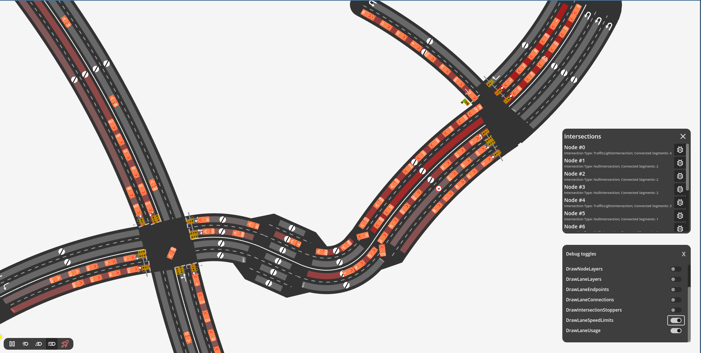
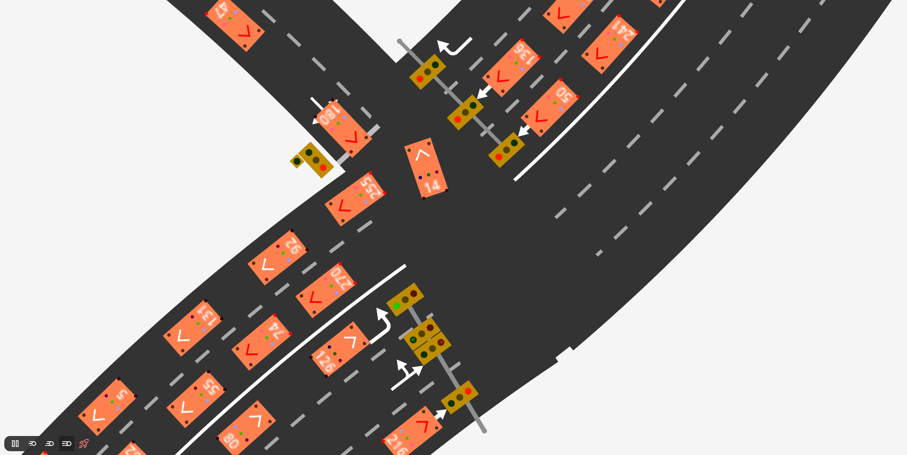
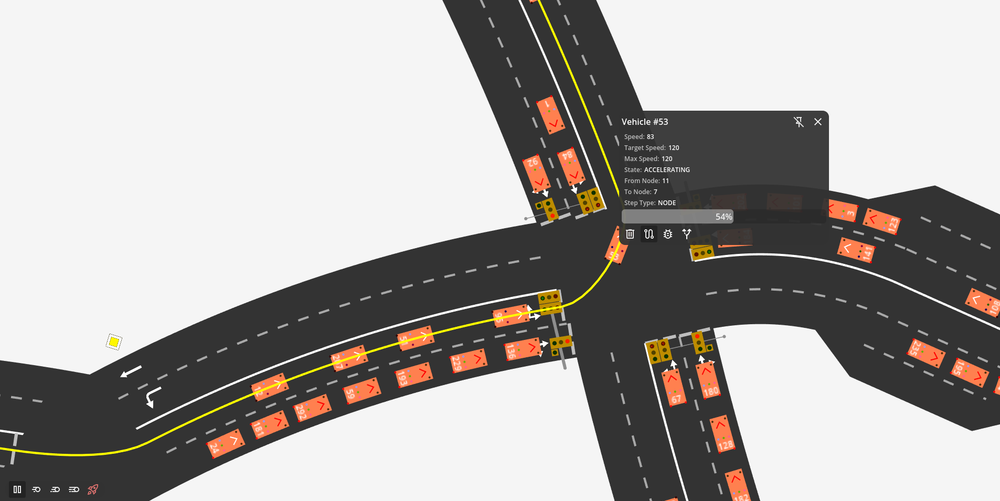

# Peak Transit

A work-in-progress transit simulation system built with Godot

## 🚧 Development Status

This project is actively under development as part of academic research. Current and planned focus areas:

**Current Implementation:**

- **Core Systems**: Network topology modeling and graph-based pathfinding
- **Performance**: Multi-threaded A\* implementation for real-time simulation
- **Architecture**: Hybrid C#/GDScript architecture with custom dependency injection

**Upcoming Development:**

- **Vehicle Design**: Bus modeling with realistic specifications and constraints
- **Schedule Management**: Dynamic scheduling system for transit operations
- **Fleet Management**: Resource allocation and vehicle deployment optimization
- **AI Integration**: API interface for reinforcement learning agent.

**Academic Project**: Part of a Master's Thesis at Cracow University of Technology focusing on usage of AI in the transportation systems in peak, rush hours.

## 🛠️ Technology Stack

- **Engine**: Godot 4.4
- **Language**: C# (.NET 8.0) with GDScript for UI components
- **Architecture**: Dependency injection with custom DI container
- **Pathfinding**: Custom A\* implementation with graph-based routing

## 🚀 Getting Started

### Prerequisites

- [Godot 4.4](https://godotengine.org/download/) or later
- [.NET 8.0 SDK](https://dotnet.microsoft.com/download)

### Installation

1. Clone the repository:

   ```bash
   git clone github.com/domiotek/peak-transit
   cd peak-transit
   ```

2. Open the project in Godot:

   - Launch Godot Engine
   - Click "Import" and select the `project.godot` file
   - Wait for the project to import and compile

3. Run the project from Godot or press F5

## 🎮 Controls

- **WASD** or **Arrow Keys**: Move camera viewport
- **F12**: Access debug interface and development tools
- **Speed Controls**:
  - `space`: pause/resume simulation
  - `1-4`: control simulation speed

## 🔧 Architecture

### Dependency Injection

The project uses a custom dependency injection container that bridges C# and GDScript:

- `DIContainer.cs`: Main DI container for C# services
- `GDInjector.gd`: GDScript interface for dependency injection
- `CSInjector.cs`: C# service locator

### Network System

- **NetGraph**: Graph representation of the transit network
- **NetNode**: Intersection points and stops
- **NetSegment**: Road/track segments connecting nodes
- **NetLane**: Individual lanes within segments

### Pathfinding

- Multi-threaded pathfinding using A\* algorithm
- Concurrent request queue for handling multiple path calculations
- Optimized for real-time simulation performance

## 🐛 Debugging

The game includes comprehensive debugging tools:

- Visual overlay for camera bounds and network elements
- Debug toggles for various system components
- Intersection analysis and visualization
- Auto-breakpoints accessible via UI for various elements on next `process` call

Access debug tools by pressing the `F12` key during gameplay.

## 📷 Screenshots

Some in-progress sneak-peaks.

### Debug Interface

The comprehensive debugging system provides real-time insights into simulation state:



### Network Visualization

Interactive intersection and network topology visualization:



### Vehicle Management

Detailed vehicle information and control interface:



## 🚧 Development Status

This project is actively under development as part of academic research. Current focus areas:

- **Core Systems**: Network topology modeling and graph-based pathfinding
- **Performance**: Multi-threaded A\* implementation for real-time simulation
- **Architecture**: Hybrid C#/GDScript architecture with dependency injection
- **Research**: Algorithm optimization for large-scale transit networks

## 📚 Research Focus

The project serves as a testbed for **Reinforcement Learning** research in transit optimization:

**Primary Research Goals:**

- **RL Environment**: Game serves as a training environment for AI agents
- **Transit Optimization**: AI-driven fleet management and scheduling decisions
- **Real-time Decision Making**: Agent responses to dynamic network conditions

**Technical Investigation Areas:**

- Efficient pathfinding algorithms for dynamic transportation networks
- Real-time simulation performance for RL training environments
- Game engine integration with machine learning frameworks
- State representation and action spaces for transit management
- Reward function design for optimal transit network performance
